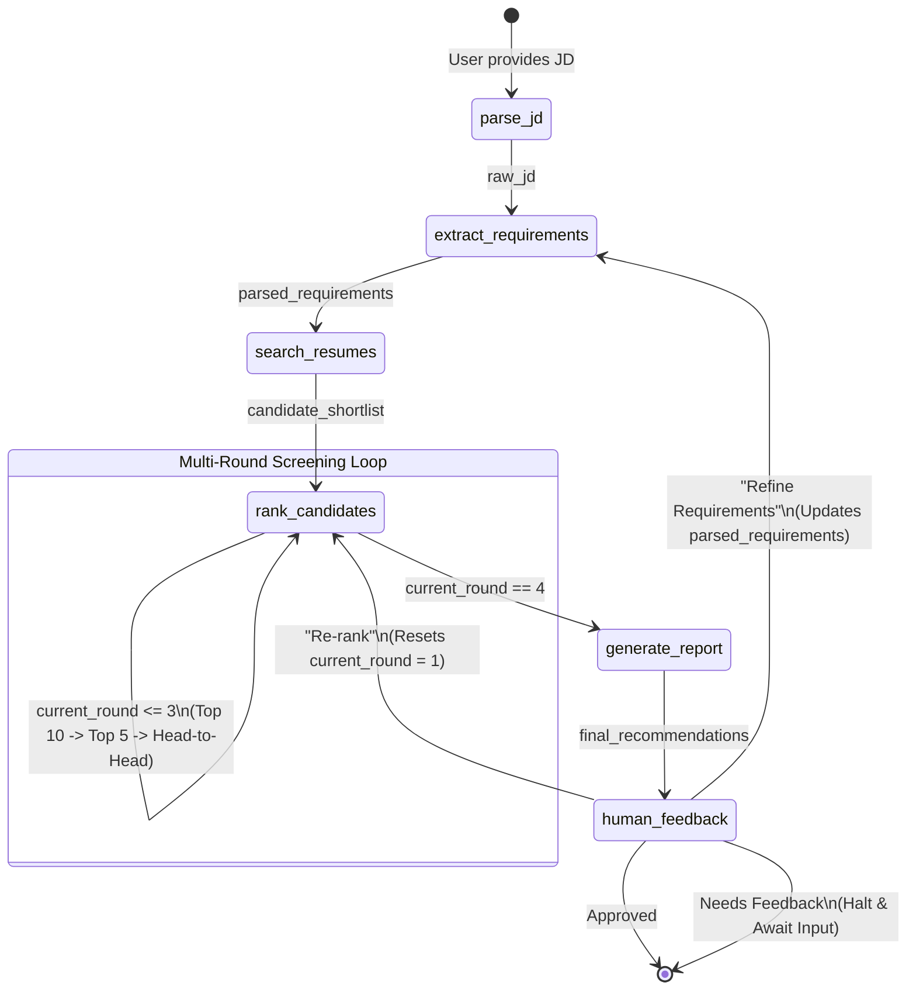

# 🎯 Agentic Profile Matching

An LLM-powered, conversational agent built on **LangGraph** that automates the end-to-end candidate screening pipeline. A recruiter interacts via natural language — the agent parses job descriptions, searches a resume corpus with RAG, ranks candidates across multiple screening rounds, and delivers explainable hire / no-hire recommendations.

## 🎥 Demo

Watch the demo video: [Agentic Profile Matching Demo](./video/agentic-profile-matching.webm)

---

## ✨ Features

- **Natural language job description parsing** — paste raw JD or upload PDF/TXT
- **Semantic resume search** — RAG over ChromaDB with BGE embeddings
- **Multi-round screening** — broad (top 10) → deep (top 5) → head-to-head final
- **Explainable recommendations** — per-candidate score breakdown with reasoning
- **Conversational refinement** — dynamically add/remove requirements mid-session
- **Streamlit chat UI** — recruiter-friendly interface with feedback buttons
- **DeepSeek LLM** — powerful agentic reasoning with `deepseek-v4-flash`
- **Resilient Rate Limiting** — custom back-off logic for robust LLM batch calls

---

## 🏗️ Architecture Overview



For the full architecture, see [`architecture.md`](./docs/architecture.md).

---

## 📁 Project Structure

```
agentic-profile-matching/
├── matching_agent.py          # LangGraph agent entry point
├── state.py                   # AgentState TypedDict
├── nodes/                     # Graph node implementations
│   ├── parse_jd.py
│   ├── extract_requirements.py
│   ├── search_resumes.py
│   ├── rank_candidates.py
│   ├── generate_report.py
│   └── human_feedback.py
├── tools/                     # LangChain @tool functions
│   ├── file_system.py         # read_resume, list_resumes
│   ├── rag_search.py          # semantic retrieval
│   ├── requirements.py        # LLM requirement extraction
│   ├── comparison.py          # LLM candidate comparison
│   └── interview.py           # LLM interview question generation
├── ingestion/                 # Resume indexing pipeline
│   ├── loader.py              # PDF / JSON / TXT loader
│   └── indexer.py             # Chunking + BGE embeddings + ChromaDB
├── prompts/                   # System & few-shot prompts
│   ├── system.py
│   └── templates.py
├── ui/
│   └── streamlit_app.py       # Streamlit chat interface
├── tests/                     # Conversation-flow test scenarios
├── data/resumes/              # Sample resume corpus
├── docs/
├── requirements.txt
├── .env.example
├── .gitignore
└── README.md
```

---

## 🚀 Quick Start

### 1. Clone & Set Up Environment

```bash
git clone <repo-url>
cd agentic-profile-matching
python -m venv .venv
# Windows
.venv\Scripts\activate
# macOS / Linux
source .venv/bin/activate
```

### 2. Install Dependencies

```bash
pip install -r requirements.txt
```

### 3. Configure Environment Variables

```bash
cp .env.example .env
# Edit .env and add your DEEPSEEK_API_KEY
```

| Variable | Description | Default |
|---|---|---|
| `DEEPSEEK_API_KEY` | Your DeepSeek API key (required) | — |
| `CHROMA_PERSIST_DIR` | ChromaDB persistence directory | `./chroma_store` |
| `RESUME_DIR` | Directory containing resume files | `./data/resumes` |
| `BGE_MODEL_NAME` | HuggingFace embedding model | `BAAI/bge-small-en-v1.5` |

Get your DeepSeek API key at [platform.deepseek.com](https://platform.deepseek.com).

### 4. Index the Resume Corpus

```bash
python -m ingestion
```

This scans `data/resumes/`, parses all PDF/JSON/TXT files, generates BGE embeddings, and persists them to ChromaDB.

### 5. Launch the Chat UI

```bash
streamlit run ui/streamlit_app.py
```

---

## 🧪 Running Tests

```bash
pytest tests/ -v --tb=short
```

---

## 🔄 Implementation Status

| Phase | Name | Status |
|---|---|---|
| **0** | Project Scaffolding | ✅ Complete |
| **1** | Agent State & Models | ✅ Complete |
| **2** | File System & Ingestion | ✅ Complete |
| **3** | RAG Search | ✅ Complete |
| **4** | LLM Tools (DeepSeek) | ✅ Complete |
| **5** | Workflow Nodes | ✅ Complete |
| **6** | Agent Assembly | ✅ Complete |
| **7** | Streamlit UI | ✅ Complete |
| **8** | Multi-Round & Explainability | ✅ Complete |
| **9** | Conversational Refinement | ✅ Complete |
| **10** | Error Handling & Rate Limiting | ✅ Complete |

---

## 📋 Key Dependencies

| Package | Purpose |
|---|---|
| `langgraph` | Agent state machine orchestration |
| `langchain-deepseek` | DeepSeek API integration |
| `chromadb` | Vector store for resume embeddings |
| `sentence-transformers` | BGE embeddings (`BAAI/bge-small-en-v1.5`) |
| `pdfplumber` | PDF resume parsing |
| `streamlit` | Recruiter chat UI |
| `python-dotenv` | Environment variable management |
| `pytest` | Test framework |

---

## 🤝 Contributing

See [`implementationPlan.md`](./implementationPlan.md) for the phase-wise roadmap.

---

## 📄 License

MIT — see [`LICENSE`](./LICENSE).
