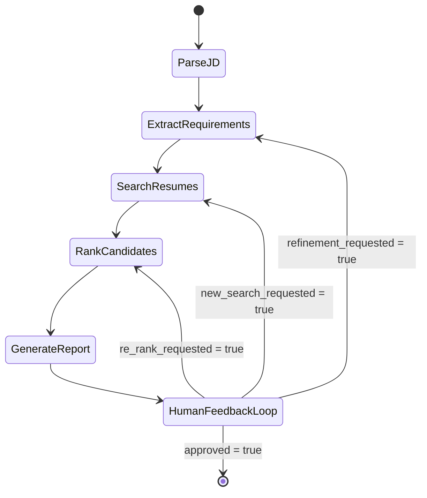
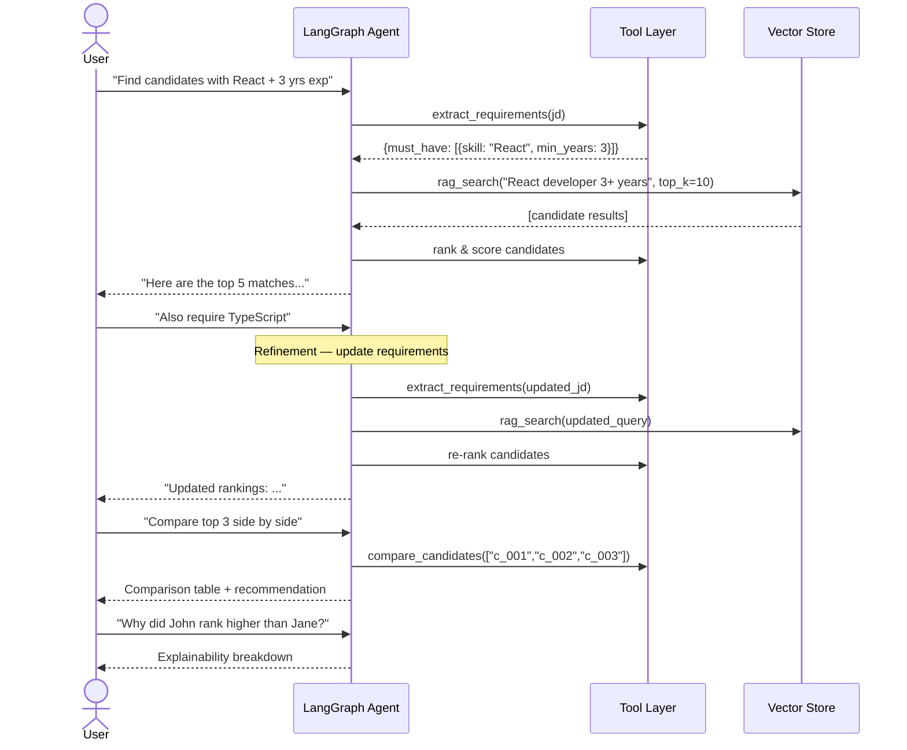

# Agentic Profile Matching — Architecture Document

## 1. System Overview

The **Agentic Profile Matching** system is an LLM-powered, conversational agent built on **LangGraph** that automates the end-to-end candidate screening pipeline. A recruiter interacts with the agent via natural language; the agent parses job descriptions, searches a resume corpus using file-system access and RAG, ranks candidates across multiple screening rounds, and delivers explainable hire / no-hire recommendations.

```
┌─────────────────────────────────────────────────────────────┐
│                      Chat Interface                         │
│                       (Streamlit)                            │
└──────────────────────────┬──────────────────────────────────┘
                           │  user message / feedback
                           ▼
┌─────────────────────────────────────────────────────────────┐
│                   LangGraph Agent Runtime                    │
│  ┌──────────┐  ┌──────────────┐  ┌───────────────────────┐  │
│  │  State    │  │  Graph Nodes │  │   Tool Executor       │  │
│  │  Manager  │  │  (workflow)  │  │ (file, RAG, LLM tools)│  │
│  └──────────┘  └──────────────┘  └───────────────────────┘  │
└──────────────────────────┬──────────────────────────────────┘
                           │
              ┌────────────┼────────────┐
              ▼            ▼            ▼
        ┌──────────┐ ┌──────────┐ ┌──────────┐
        │  File    │ │  Vector  │ │   LLM    │
        │  System  │ │  Store   │ │  Provider│
        │ (Resumes)│ │ (ChromaDB│ │  (Groq)  │
        │          │ │         )│ │          │
        └──────────┘ └──────────┘ └──────────┘
```

---

## 2. Project Directory Structure

```
agentic-profile-matching/
├── matching_agent.py          # Entry point — LangGraph agent definition
├── state.py                   # AgentState TypedDict / Pydantic model
├── nodes/                     # One module per graph node
│   ├── __init__.py
│   ├── parse_jd.py            # Parse Job Description node
│   ├── extract_requirements.py# Extract Requirements node
│   ├── search_resumes.py      # Search Resumes node
│   ├── rank_candidates.py     # Rank Candidates node
│   ├── generate_report.py     # Generate Report node
│   └── human_feedback.py      # Human Feedback Loop node
├── tools/                     # LangChain-style @tool functions
│   ├── __init__.py
│   ├── file_system.py         # read_resume, list_resumes
│   ├── rag_search.py          # rag_search (vector retrieval)
│   ├── requirements.py        # extract_requirements
│   ├── comparison.py          # compare_candidates
│   └── interview.py           # generate_interview_questions
├── ingestion/                 # Resume ingestion & vectorisation
│   ├── __init__.py
│   ├── loader.py              # PDF / JSON / TXT resume loader
│   └── indexer.py             # Chunk, embed, upsert into vector store
├── prompts/                   # System & few-shot prompt templates
│   ├── system.py
│   └── templates.py
├── ui/                        # Chat interface layer
│   └── streamlit_app.py       # Streamlit chat UI
├── tests/                     # ≥ 5 conversation-flow test scenarios
│   ├── test_parse_jd.py
│   ├── test_ranking.py
│   ├── test_refinement.py
│   ├── test_comparison.py
│   └── test_explainability.py
├── data/
│   └── resumes/               # Sample resume corpus
├── docs/
│   ├── problemStatement.txt
│   └── state_machine_diagram.png
├── context.md
├── architecture.md            # ← this file
├── requirements.txt
├── .env.example
└── README.md
```

---

## 3. Agent State Design

All graph nodes read from and write to a single shared **AgentState** object. The state is defined as a `TypedDict` (or Pydantic `BaseModel`) and persists across turns within a conversation.

```python
from typing import TypedDict, Optional
from langchain_core.messages import BaseMessage

class Requirement(TypedDict):
    skill: str
    category: str            # "must_have" | "nice_to_have"
    min_years: Optional[int]

class CandidateScore(TypedDict):
    candidate_id: str
    name: str
    overall_score: float          # 0 – 100
    skill_match: dict             # skill → score
    experience_fit: float
    strengths: list[str]
    gaps: list[str]
    reasoning: str

class AgentState(TypedDict):
    # Conversation
    messages: list[BaseMessage]         # full chat history

    # Job Description
    raw_jd: str                         # original JD text
    parsed_requirements: list[Requirement]

    # Candidates
    candidate_shortlist: list[CandidateScore]
    comparison_results: Optional[dict]

    # Screening round tracking
    current_round: int                  # 1, 2, or 3 (final)
    round_history: list[dict]           # snapshots per round

    # Decision
    final_recommendations: Optional[list[dict]]

    # Control flow
    needs_human_feedback: bool
    refinement_requested: bool
```

### State Transitions Summary

| Field Written | Written By Node |
|---|---|
| `raw_jd` | Parse Job Description |
| `parsed_requirements` | Extract Requirements |
| `candidate_shortlist` | Search Resumes / Rank Candidates |
| `comparison_results` | Rank Candidates (via compare tool) |
| `current_round`, `round_history` | Rank Candidates |
| `final_recommendations` | Generate Report |
| `needs_human_feedback` | Human Feedback Loop |
| `refinement_requested` | Human Feedback Loop |

---

## 4. LangGraph Workflow — State Machine



### Node Descriptions

| # | Node | Responsibility | Key Inputs | Key Outputs |
|---|---|---|---|---|
| 1 | **Parse Job Description** | Accept raw JD text (pasted or file path) and normalise it | User message / file path | `raw_jd` |
| 2 | **Extract Requirements** | Use LLM to split JD into must-have and nice-to-have lists | `raw_jd` | `parsed_requirements` |
| 3 | **Search Resumes** | Use **File System Tools** to discover resumes, then **RAG Search** to retrieve semantically relevant ones | `parsed_requirements` | initial `candidate_shortlist` |
| 4 | **Rank Candidates** | Score and rank shortlisted candidates; optionally invoke **Compare Candidates** tool for head-to-head analysis | `candidate_shortlist`, `parsed_requirements` | ranked `candidate_shortlist`, `comparison_results`, `round_history` |
| 5 | **Generate Report** | Compile per-candidate match reports with strengths, gaps, and hire/no-hire recommendations | ranked list | `final_recommendations` |
| 6 | **Human Feedback Loop** | Present results, accept follow-up queries, route to refinement or termination | user feedback | routing decision flags |

### Conditional Routing Logic

```python
def route_after_feedback(state: AgentState) -> str:
    if state["refinement_requested"]:
        return "extract_requirements"   # re-parse with updated criteria
    if state.get("new_search_requested"):
        return "search_resumes"         # broaden / narrow search
    if state.get("re_rank_requested"):
        return "rank_candidates"        # re-score with new weights
    return END                          # user accepted results
```

---

## 5. Tool Specifications

### 5.1 File System Tools

| Function | Signature | Description |
|---|---|---|
| `read_resume` | `read_resume(file_path: str) → str` | Read and return the raw text content of a single resume file (PDF, JSON, or TXT). Handles format detection and text extraction internally. |
| `list_resumes` | `list_resumes(directory: str) → list[str]` | Recursively list all resume file paths under the given directory. Returns absolute paths. |

**Implementation notes:**
- Use `PyPDF2` or `pdfplumber` for PDF extraction.
- Support `.json`, `.txt`, and `.pdf` formats.
- Wrap as `@tool` decorated functions for LangChain/LangGraph compatibility.

---

### 5.2 RAG Search Tool

| Function | Signature | Description |
|---|---|---|
| `rag_search` | `rag_search(query: str, top_k: int = 10) → list[dict]` | Perform semantic similarity search over the indexed resume vector store. Returns a ranked list of `{ candidate_id, file_path, relevance_score, snippet }` dicts. |

**Implementation notes:**
- **Embedding model:** BAAI BGE model — e.g. `BAAI/bge-small-en-v1.5` (lightweight, local) or `BAAI/bge-large-en-v1.5` (higher accuracy). Run via HuggingFace `sentence-transformers`.
- **Vector store:** ChromaDB (persistent, metadata filtering, built-in embedding support).
- **Chunking strategy:** Split resumes into ~500-token chunks with 50-token overlap.
- **Metadata stored per chunk:** `candidate_id`, `file_path`, `section` (education / experience / skills).

#### Ingestion Pipeline

```
Resume Files ──► Loader ──► Text Chunks ──► Embeddings ──► Vector Store
     │                          │                              │
  PDF/JSON/TXT          ~500 tokens each              ChromaDB index
```

---

### 5.3 Extract Requirements Tool

| Function | Signature | Description |
|---|---|---|
| `extract_requirements` | `extract_requirements(jd: str) → dict` | Use LLM to parse a job description into structured requirement categories. |

**Return schema:**

```python
{
    "must_have": [
        {"skill": "React", "min_years": 3},
        {"skill": "TypeScript", "min_years": 1}
    ],
    "nice_to_have": [
        {"skill": "GraphQL", "min_years": null},
        {"skill": "AWS", "min_years": null}
    ],
    "experience_range": {"min": 3, "max": 7},
    "education": "Bachelor's in CS or equivalent"
}
```

---

### 5.4 Compare Candidates Tool

| Function | Signature | Description |
|---|---|---|
| `compare_candidates` | `compare_candidates(candidate_ids: list[str]) → dict` | Head-to-head comparison of 2+ candidates across all requirement dimensions. |

**Return schema:**

```python
{
    "candidates": ["c_001", "c_002", "c_003"],
    "comparison_matrix": {
        "React":      {"c_001": 9, "c_002": 7, "c_003": 8},
        "TypeScript":  {"c_001": 6, "c_002": 9, "c_003": 7},
        ...
    },
    "summary": "Candidate c_001 leads in React expertise, while c_002 ...",
    "recommendation": "c_001"
}
```

---

### 5.5 Generate Interview Questions Tool

| Function | Signature | Description |
|---|---|---|
| `generate_interview_questions` | `generate_interview_questions(candidate_id: str) → dict` | Generate tailored technical and behavioural questions targeting a specific candidate's gaps and strengths. |

**Return schema:**

```python
{
    "candidate_id": "c_001",
    "technical_questions": [
        "Describe how you would optimise a React app with ...",
        ...
    ],
    "behavioral_questions": [
        "Tell me about a time you led a cross-functional ...",
        ...
    ],
    "gap_probing_questions": [
        "Your resume doesn't mention TypeScript — how would ...",
        ...
    ]
}
```

---

## 6. Multi-Round Screening Pipeline

The agent conducts screening in three progressive rounds, each narrowing the candidate pool and deepening analysis.


| Round | Input | Process | Output |
|---|---|---|---|
| **Round 1** | Entire resume corpus | RAG search + coarse scoring against must-have requirements | Top 10 candidates |
| **Round 2** | Top 10 from Round 1 | Deep per-candidate analysis: skills audit, experience mapping, project relevance, cultural fit signals | Scored & ranked shortlist (top 3–5) |
| **Final** | Top 3–5 from Round 2 | Head-to-head comparison, generate match reports, produce Hire / No-Hire with reasoning | Final recommendations |

---

## 7. Conversational & Refinement Flow



### Supported Interaction Patterns

| Pattern | Example Query | Agent Behaviour |
|---|---|---|
| **Initial Search** | "Find me candidates with React and 3+ years experience." | Extract requirements → RAG search → Rank → Report |
| **Refinement** | "Add TypeScript as a must-have." | Update `parsed_requirements` → Re-search → Re-rank |
| **Comparison** | "Compare the top 3 matches side by side." | Invoke `compare_candidates` → Tabular output |
| **Explainability** | "Why did John rank higher than Jane?" | Pull reasoning from `candidate_shortlist` scores |
| **Interview Prep** | "Generate interview questions for candidate #2." | Invoke `generate_interview_questions` → Custom Q set |
| **Approval / Reject** | "Looks good, finalize." / "Start over with different criteria." | End session or loop back |

---

## 8. Data Flow & Integration Map

```
┌──────────────┐     ┌───────────────────┐     ┌────────────────┐
│  Resume Files│────►│  Ingestion Layer   │────►│  Vector Store  │
│  (data/      │     │  loader.py         │     │  (ChromaDB)    │
│   resumes/)  │     │  indexer.py        │     │                │
└──────────────┘     └───────────────────┘     └───────┬────────┘
                                                       │
                                                       │ semantic search
                                                       ▼
┌──────────────┐     ┌───────────────────┐     ┌────────────────┐
│  User Input  │────►│  LangGraph Agent  │◄───►│  LLM Provider  │
│ (Streamlit)  │     │  matching_agent.py│     │  (Groq)        │
└──────────────┘     └───────────────────┘     │                │
                            │                  └────────────────┘
                            ▼
                     ┌───────────────────┐
                     │  Reports &        │
                     │  Recommendations  │
                     └───────────────────┘
```

---

## 9. Technology Stack

| Layer | Technology | Purpose |
|---|---|---|
| **Agent Framework** | LangGraph | Stateful, graph-based agent orchestration |
| **LLM SDK** | LangChain | Tool binding, prompt templates, LLM abstraction |
| **LLM Provider** | Groq (`llama-3.3-70b-versatile` / `mixtral-8x7b-32768`) | Ultra-fast reasoning, extraction, generation via Groq inference |
| **Embeddings** | BAAI BGE (`BAAI/bge-small-en-v1.5` or `bge-large-en-v1.5`) via `sentence-transformers` | Resume chunk embeddings |
| **Vector Store** | ChromaDB | Persistent semantic search index with metadata filtering |
| **PDF Parsing** | `pdfplumber` / `PyPDF2` | Resume text extraction |
| **Chat UI** | Streamlit | Interactive, rich chat interface |
| **Testing** | `pytest` | Conversation flow tests |
| **Environment** | `python-dotenv` | API key & config management |
| **Language** | Python 3.11+ | Runtime |

---

## 10. Key Design Decisions

| Decision | Chosen Approach | Rationale |
|---|---|---|
| **State management** | LangGraph `StateGraph` with `TypedDict` | Type-safe, inspectable, supports conditional edges |
| **Screening rounds** | Encoded in state (`current_round`) with loop-back edges | Avoids separate graphs; single graph handles all rounds |
| **Refinement** | Conditional edge from Human Feedback → Extract Requirements / Rank | Allows mid-conversation criteria changes without restarting |
| **Tool binding** | LangChain `@tool` decorator + `ToolNode` | Standardised invocation, automatic schema generation |
| **Explainability** | Per-candidate `reasoning` field populated during ranking | Always available for "why" queries without re-computation |
| **Persistence** | In-memory (MVP) → LangGraph checkpointer (production) | Start simple, add durability when needed |

---

## 11. Error Handling & Edge Cases

| Scenario | Handling Strategy |
|---|---|
| No resumes match the JD | Return empty shortlist with message; suggest loosening requirements |
| Resume file is corrupted / unreadable | Log warning, skip file, continue with remaining resumes |
| LLM rate limit / timeout | Exponential back-off retry (max 3 attempts) |
| User provides ambiguous JD | Agent asks clarifying questions before proceeding |
| Refinement invalidates prior scores | Clear stale scores, re-run affected rounds only |
| Vector store not initialised | Auto-trigger ingestion pipeline on first search |

---

## 12. Testing Strategy

Five required conversation-flow test scenarios:

| # | Test Scenario | Validates |
|---|---|---|
| 1 | **End-to-end JD → Hire recommendation** | Full pipeline: parse → search → rank → report |
| 2 | **Mid-conversation refinement** | Adding a new must-have skill re-ranks correctly |
| 3 | **Candidate comparison** | `compare_candidates` returns accurate side-by-side matrix |
| 4 | **Explainability query** | "Why X over Y?" returns valid reasoning from state |
| 5 | **Multi-round screening** | Round 1 (10) → Round 2 (5) → Final (hire/no-hire) progression |

```bash
# Run all tests
pytest tests/ -v --tb=short

# Run a specific flow
pytest tests/test_ranking.py -v
```

---

## 13. Future Enhancements

- **Webhook / API layer** — expose the agent as a REST/GraphQL endpoint for ATS integration.
- **Batch processing** — score an entire candidate pool against multiple JDs concurrently.
- **Memory across sessions** — persist conversation history using LangGraph checkpointers for returning recruiters.
- **Fine-tuned scoring model** — train a lightweight classifier on historical hire decisions to improve ranking accuracy.
- **Multi-modal resumes** — extract info from resume images, portfolio screenshots, and LinkedIn exports.
