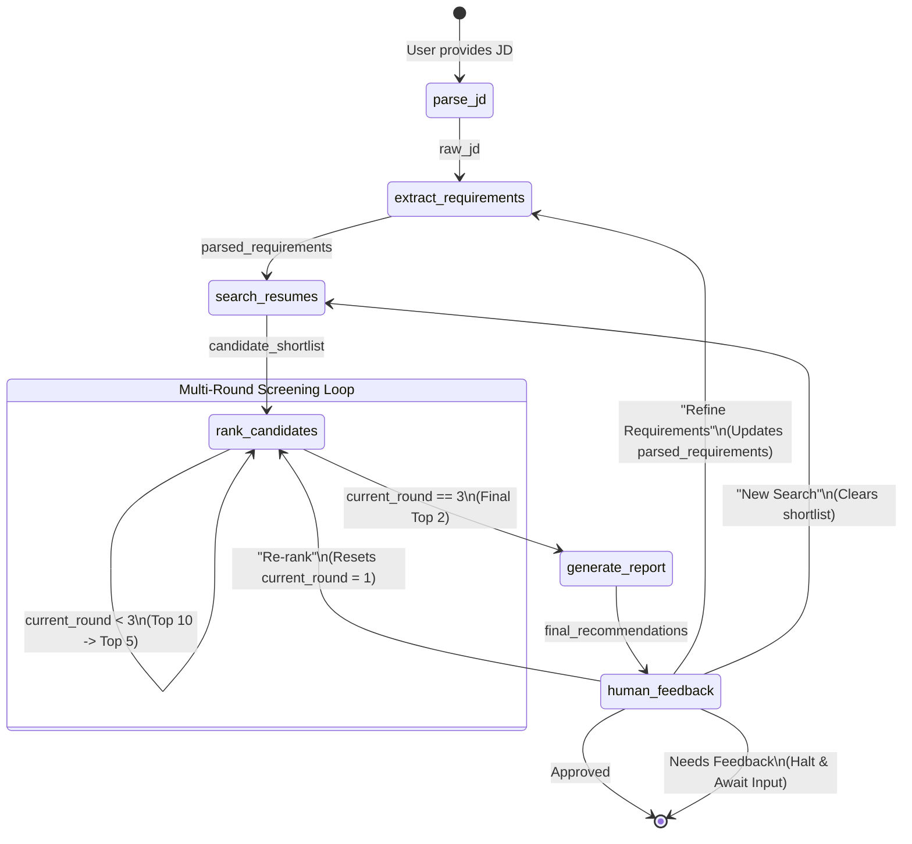

```mermaid
stateDiagram-v2
    [*] --> parse_jd : User provides JD
    
    parse_jd --> extract_requirements : raw_jd
    
    extract_requirements --> search_resumes : parsed_requirements
    
    search_resumes --> rank_candidates : candidate_shortlist
    
    state "Multi-Round Screening Loop" as MRL {
        rank_candidates --> rank_candidates : current_round < 3\n(Top 10 -> Top 5)
    }
    
    rank_candidates --> generate_report : current_round == 3\n(Final Top 2)
    
    generate_report --> human_feedback : final_recommendations
    
    human_feedback --> [*] : Approved
    
    human_feedback --> [*] : Needs Feedback\n(Halt & Await Input)
    
    human_feedback --> extract_requirements : "Refine Requirements"\n(Updates parsed_requirements)
    
    human_feedback --> search_resumes : "New Search"\n(Clears shortlist)
    
    human_feedback --> rank_candidates : "Re-rank"\n(Resets current_round = 1)
```
