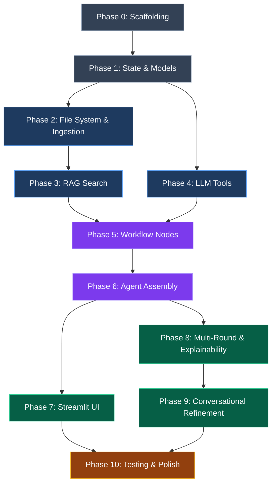

# Agentic Profile Matching — Implementation Plan

> **Phase-wise roadmap** derived from [architecture.md](file:///c:/Users/MJ/Desktop/Projects/Airtribe/agentic-profile-matching/architecture.md). Each phase is self-contained and produces a testable deliverable.

---

## Phase 0 — Project Scaffolding & Environment Setup

**Goal:** Bootable project with all dependencies installed and configuration wired up.

**Duration:** ~0.5 day

### Tasks

| # | Task | File(s) | Details |
|---|---|---|---|
| 0.1 | Initialise project structure | All directories | Create the full directory tree as defined in architecture §2 |
| 0.2 | Create `requirements.txt` | `requirements.txt` | Pin core dependencies (see below) |
| 0.3 | Environment config | `.env.example`, `.env` | `GROQ_API_KEY`, `CHROMA_PERSIST_DIR`, `RESUME_DIR`, `BGE_MODEL_NAME` |
| 0.4 | Install dependencies | — | `pip install -r requirements.txt` |
| 0.5 | Add sample resumes | `data/resumes/` | 10–15 sample resumes (mix of PDF, JSON, TXT) for development & testing |
| 0.6 | Create `README.md` | `README.md` | Project overview, setup steps, usage instructions |

### Key Dependencies

```txt
langchain>=0.2
langgraph>=0.1
langchain-groq
chromadb
sentence-transformers
pdfplumber
streamlit
python-dotenv
pytest
```

### Exit Criteria

- [x] `pip install -r requirements.txt` succeeds without errors
- [x] `.env.example` documents all required env vars
- [x] `data/resumes/` contains sample resumes
- [x] All directories from the architecture tree exist

---

## Phase 1 — Agent State & Data Models

**Goal:** Define the shared `AgentState` and supporting data models that all nodes and tools will use.

**Duration:** ~0.5 day

### Tasks

| # | Task | File(s) | Details |
|---|---|---|---|
| 1.1 | Define `Requirement` model | `state.py` | TypedDict with `skill`, `category` (must_have / nice_to_have), `min_years` |
| 1.2 | Define `CandidateScore` model | `state.py` | TypedDict with `candidate_id`, `name`, `overall_score`, `skill_match`, `experience_fit`, `strengths`, `gaps`, `reasoning` |
| 1.3 | Define `AgentState` | `state.py` | Full TypedDict: `messages`, `raw_jd`, `parsed_requirements`, `candidate_shortlist`, `comparison_results`, `current_round`, `round_history`, `final_recommendations`, `needs_human_feedback`, `refinement_requested` |
| 1.4 | Unit tests for state | `tests/test_state.py` | Validate defaults, type correctness, serialisability |

### Exit Criteria

- [x] `state.py` imports cleanly
- [x] State models match architecture §3 exactly
- [x] Unit tests pass

---

## Phase 2 — File System Tools & Resume Ingestion

**Goal:** Build the data layer — read resumes from disk, parse them, chunk, embed with BGE, and index into ChromaDB.

**Duration:** ~1.5 days

### Tasks

| # | Task | File(s) | Details |
|---|---|---|---|
| 2.1 | Implement `read_resume` tool | `tools/file_system.py` | Auto-detect format (PDF via `pdfplumber`, JSON via `json.load`, TXT via `open`). Return raw text. Wrap with `@tool`. |
| 2.2 | Implement `list_resumes` tool | `tools/file_system.py` | Recursively walk `directory`, filter by `.pdf/.json/.txt` extensions. Return list of absolute paths. Wrap with `@tool`. |
| 2.3 | Resume loader | `ingestion/loader.py` | Unified `load_resume(path) → str` function. Handle corrupted files gracefully (log & skip). |
| 2.4 | Resume chunker & indexer | `ingestion/indexer.py` | Chunk text into ~500-token segments with 50-token overlap. Embed using `BAAI/bge-small-en-v1.5` via `sentence-transformers`. Upsert into ChromaDB with metadata: `candidate_id`, `file_path`, `section`. |
| 2.5 | Ingestion CLI entry point | `ingestion/__init__.py` | `python -m ingestion` to run bulk indexing of `data/resumes/` |
| 2.6 | Tests | `tests/test_file_system.py`, `tests/test_ingestion.py` | Test file reading (all 3 formats), chunking output, ChromaDB upsert & retrieval |

### Key Implementation Details

```python
# ingestion/indexer.py — core logic sketch
from sentence_transformers import SentenceTransformer
import chromadb

model = SentenceTransformer("BAAI/bge-small-en-v1.5")
client = chromadb.PersistentClient(path=CHROMA_PERSIST_DIR)
collection = client.get_or_create_collection("resumes")

def index_resume(candidate_id: str, text: str, file_path: str):
    chunks = chunk_text(text, chunk_size=500, overlap=50)
    embeddings = model.encode(chunks).tolist()
    collection.upsert(
        ids=[f"{candidate_id}_chunk_{i}" for i in range(len(chunks))],
        documents=chunks,
        embeddings=embeddings,
        metadatas=[{"candidate_id": candidate_id, "file_path": file_path, "section": detect_section(c)} for i, c in enumerate(chunks)]
    )
```

### Exit Criteria

- [x] `read_resume` handles PDF, JSON, TXT without error
- [x] `list_resumes` discovers all sample resumes
- [x] `python -m ingestion` indexes all sample resumes into ChromaDB
- [x] ChromaDB persists to disk and survives restarts

---

## Phase 3 — RAG Search Tool

**Goal:** Implement semantic search over the ChromaDB index using BGE embeddings.

**Duration:** ~1 day

### Tasks

| # | Task | File(s) | Details |
|---|---|---|---|
| 3.1 | Implement `rag_search` tool | `tools/rag_search.py` | Accept `query` + `top_k`, embed query with BGE, query ChromaDB, return `[{candidate_id, file_path, relevance_score, snippet}]`. Wrap with `@tool`. |
| 3.2 | Deduplication logic | `tools/rag_search.py` | Multiple chunks from the same candidate may match — deduplicate by `candidate_id`, keep highest relevance score. |
| 3.3 | Tests | `tests/test_rag_search.py` | Test retrieval relevance, top_k filtering, deduplication, empty-result handling |

### Key Implementation Details

```python
# tools/rag_search.py — core logic sketch
@tool
def rag_search(query: str, top_k: int = 10) -> list[dict]:
    """Semantic search over indexed resumes."""
    query_embedding = model.encode(query).tolist()
    results = collection.query(query_embeddings=[query_embedding], n_results=top_k * 3)
    # Deduplicate by candidate_id, keep best score
    return deduplicate_and_rank(results, top_k)
```

### Exit Criteria

- [x] `rag_search("React developer 3 years")` returns relevant candidates from sample data
- [x] Deduplication works correctly
- [x] Handles empty index gracefully

---

## Phase 4 — LLM-Powered Tools (Groq)

**Goal:** Implement the three LLM-dependent tools using Groq as the provider.

**Duration:** ~1.5 days

### Tasks

| # | Task | File(s) | Details |
|---|---|---|---|
| 4.1 | Groq LLM setup | `prompts/system.py` | Initialise `ChatGroq` with `llama-3.3-70b-versatile`. Configure temperature, max_tokens. |
| 4.2 | System & few-shot prompts | `prompts/templates.py` | Prompt templates for requirement extraction, candidate comparison, interview question generation |
| 4.3 | Implement `extract_requirements` | `tools/requirements.py` | Send JD to Groq LLM with structured output prompt. Parse response into `{must_have, nice_to_have, experience_range, education}`. Wrap with `@tool`. |
| 4.4 | Implement `compare_candidates` | `tools/comparison.py` | Accept candidate IDs → fetch their scores from state → send to Groq for head-to-head analysis. Return comparison matrix + summary. Wrap with `@tool`. |
| 4.5 | Implement `generate_interview_questions` | `tools/interview.py` | Accept candidate ID → fetch profile → send to Groq with gap analysis. Return technical, behavioural, and gap-probing questions. Wrap with `@tool`. |
| 4.6 | Error handling | All tool files | Implement exponential back-off retry (max 3 attempts) for Groq API calls |
| 4.7 | Tests | `tests/test_tools.py` | Test each tool with mocked LLM responses; test retry logic |

### Exit Criteria

- [x] `extract_requirements(jd_text)` returns valid structured JSON
- [x] `compare_candidates(["c_001", "c_002"])` returns comparison matrix
- [x] `generate_interview_questions("c_001")` returns categorised questions
- [x] Retry logic handles Groq rate limits

---

## Phase 5 — LangGraph Workflow Nodes

**Goal:** Implement all 6 graph nodes that form the agent's workflow pipeline.

**Duration:** ~2 days

### Tasks

| # | Task | File(s) | Details |
|---|---|---|---|
| 5.1 | Parse Job Description node | `nodes/parse_jd.py` | Extract JD from user message (pasted text or file path). Normalise and store in `state["raw_jd"]`. |
| 5.2 | Extract Requirements node | `nodes/extract_requirements.py` | Call `extract_requirements` tool. Store result in `state["parsed_requirements"]`. |
| 5.3 | Search Resumes node | `nodes/search_resumes.py` | Build search query from `parsed_requirements`. Call `list_resumes` + `rag_search`. Store initial `candidate_shortlist`. |
| 5.4 | Rank Candidates node | `nodes/rank_candidates.py` | Score candidates against requirements using Groq. Update `candidate_shortlist` with scores. Track `current_round` and `round_history`. Optionally call `compare_candidates`. |
| 5.5 | Generate Report node | `nodes/generate_report.py` | Compile per-candidate match reports. Produce strengths, gaps, hire/no-hire recommendations. Store in `final_recommendations`. |
| 5.6 | Human Feedback Loop node | `nodes/human_feedback.py` | Present results to user. Parse feedback to set `refinement_requested`, `new_search_requested`, `re_rank_requested`, or `approved` flags. |
| 5.7 | Tests for each node | `tests/test_parse_jd.py`, etc. | Unit test each node in isolation with mocked state |

### Node → State Mapping

```
parse_jd.py             → writes: raw_jd
extract_requirements.py → writes: parsed_requirements
search_resumes.py       → writes: candidate_shortlist
rank_candidates.py      → writes: candidate_shortlist, comparison_results, current_round, round_history
generate_report.py      → writes: final_recommendations
human_feedback.py       → writes: needs_human_feedback, refinement_requested
```

### Exit Criteria

- [x] Each node function accepts `AgentState` and returns a partial state update
- [x] Node unit tests pass with mocked dependencies
- [x] Nodes are stateless — all data flows through `AgentState`

---

## Phase 6 — LangGraph Agent Assembly

**Goal:** Wire all nodes into a `StateGraph`, add conditional edges, and produce the working agent.

**Duration:** ~1.5 days

### Tasks

| # | Task | File(s) | Details |
|---|---|---|---|
| 6.1 | Build `StateGraph` | `matching_agent.py` | Add all 6 nodes. Wire linear edges: `START → parse_jd → extract_requirements → search_resumes → rank_candidates → generate_report → human_feedback`. |
| 6.2 | Conditional routing | `matching_agent.py` | Implement `route_after_feedback()` function. Add conditional edges from `human_feedback` → `extract_requirements` / `search_resumes` / `rank_candidates` / `END`. |
| 6.3 | Multi-round logic | `matching_agent.py` | Add conditional edge from `rank_candidates` back to itself for Round 1 → Round 2 → Final progression. |
| 6.4 | Tool binding | `matching_agent.py` | Bind all 5 tools to the agent via `ToolNode`. |
| 6.5 | Agent invocation wrapper | `matching_agent.py` | `run_agent(user_input: str) → AgentState` convenience function for programmatic use. |
| 6.6 | State machine diagram | `docs/state_machine_diagram.png` | Export Mermaid diagram from architecture §4 as PNG |
| 6.7 | Integration test | `tests/test_agent_e2e.py` | End-to-end: JD input → final recommendations |

### Core Assembly Code

```python
# matching_agent.py — skeleton
from langgraph.graph import StateGraph, END
from state import AgentState
from nodes import parse_jd, extract_requirements, search_resumes, rank_candidates, generate_report, human_feedback

graph = StateGraph(AgentState)

# Add nodes
graph.add_node("parse_jd", parse_jd.run)
graph.add_node("extract_requirements", extract_requirements.run)
graph.add_node("search_resumes", search_resumes.run)
graph.add_node("rank_candidates", rank_candidates.run)
graph.add_node("generate_report", generate_report.run)
graph.add_node("human_feedback", human_feedback.run)

# Linear edges
graph.set_entry_point("parse_jd")
graph.add_edge("parse_jd", "extract_requirements")
graph.add_edge("extract_requirements", "search_resumes")
graph.add_edge("search_resumes", "rank_candidates")
graph.add_edge("rank_candidates", "generate_report")
graph.add_edge("generate_report", "human_feedback")

# Conditional routing from feedback
graph.add_conditional_edges("human_feedback", route_after_feedback, {
    "extract_requirements": "extract_requirements",
    "search_resumes": "search_resumes",
    "rank_candidates": "rank_candidates",
    END: END
})

agent = graph.compile()
```

### Exit Criteria

- [x] `agent.invoke({"messages": [user_message]})` runs the full pipeline
- [x] Conditional edges route correctly based on feedback flags
- [x] Multi-round screening progresses Round 1 → 2 → Final
- [x] End-to-end test passes

---

## Phase 7 — Streamlit Chat Interface

**Goal:** Build a rich, interactive chat UI for recruiters to interact with the agent.

**Duration:** ~1.5 days

### Tasks

| # | Task | File(s) | Details |
|---|---|---|---|
| 7.1 | Basic chat layout | `ui/streamlit_app.py` | Streamlit chat interface with `st.chat_input` and `st.chat_message`. Display conversation history. |
| 7.2 | Agent integration | `ui/streamlit_app.py` | Wire Streamlit input → `agent.invoke()` → display response. Maintain session state for `AgentState`. |
| 7.3 | JD upload | `ui/streamlit_app.py` | `st.file_uploader` for JD files (PDF/TXT). Parse and pass to agent. |
| 7.4 | Results display | `ui/streamlit_app.py` | Render candidate cards, comparison tables, and match reports using `st.dataframe`, `st.expander`, `st.metric`. |
| 7.5 | Feedback buttons | `ui/streamlit_app.py` | "Refine", "Compare Top N", "Approve", "Start Over" action buttons that route back into the agent loop. |
| 7.6 | Styling & polish | `ui/streamlit_app.py` | Custom CSS, branded header, loading spinners, sidebar for settings. |
| 7.7 | Run script | — | `streamlit run ui/streamlit_app.py` |

### UI Layout Sketch

```
┌─────────────────────────────────────────────────┐
│  🎯 Agentic Profile Matcher          [Settings] │
├─────────────────────────────────────────────────┤
│                                                 │
│  👤 User: Find candidates with React + 3 yrs   │
│                                                 │
│  🤖 Agent: Found 8 matching candidates.         │
│           Here are the top 5:                   │
│           ┌─────────────────────────────────┐   │
│           │ #1  John Doe   — Score: 92/100  │   │
│           │ #2  Jane Smith — Score: 87/100  │   │
│           │ ...                             │   │
│           └─────────────────────────────────┘   │
│                                                 │
│  [Refine] [Compare Top 3] [Approve] [Start Over]│
│                                                 │
├─────────────────────────────────────────────────┤
│  💬 Type your message...              [Send]    │
└─────────────────────────────────────────────────┘
```

### Exit Criteria

- [x] `streamlit run ui/streamlit_app.py` launches the app
- [x] Full conversation loop works end-to-end through the UI
- [x] JD file upload works
- [x] Results render with candidate cards and comparison tables
- [x] Feedback buttons trigger correct agent re-routing

---

## Phase 8 — Multi-Round Screening & Explainability

**Goal:** Implement the 3-round screening pipeline and detailed explainability features.

**Duration:** ~1.5 days

### Tasks

| # | Task | File(s) | Details |
|---|---|---|---|
| 8.1 | Round 1: Broad screen | `nodes/rank_candidates.py` | RAG search full corpus → coarse score against must-haves → select top 10. Store snapshot in `round_history`. |
| 8.2 | Round 2: Deep analysis | `nodes/rank_candidates.py` | Detailed per-candidate analysis of top 10: skills audit, experience mapping, project relevance. Narrow to top 3–5. |
| 8.3 | Final round: Decision | `nodes/rank_candidates.py` | Head-to-head via `compare_candidates`. Generate hire/no-hire with full reasoning. |
| 8.4 | Round progression logic | `matching_agent.py` | Conditional edge: if `current_round < 3`, loop `rank_candidates` back to itself with incremented round. |
| 8.5 | Match reports | `nodes/generate_report.py` | Per-candidate reports with: overall score, skill-by-skill breakdown, strengths, gaps, improvement suggestions for borderline candidates. |
| 8.6 | Explainability queries | `nodes/human_feedback.py` | Detect "why" / "explain" queries. Pull reasoning from `candidate_shortlist[].reasoning` and `round_history`. |
| 8.7 | Tests | `tests/test_ranking.py`, `tests/test_explainability.py` | Validate round progression, score consistency, reasoning output |

### Exit Criteria

- [x] 3-round pipeline: full corpus → top 10 → top 3–5 → hire/no-hire
- [x] Round history tracks snapshots correctly
- [x] "Why did X rank higher than Y?" returns valid reasoning
- [x] Borderline candidates get improvement suggestions

---

## Phase 9 — Conversational Refinement

**Goal:** Enable mid-conversation requirement changes with dynamic re-ranking.

**Duration:** ~1 day

### Tasks

| # | Task | File(s) | Details |
|---|---|---|---|
| 9.1 | Detect refinement intent | `nodes/human_feedback.py` | NLU to detect phrases like "also require…", "remove the TypeScript requirement", "change min experience to 5 years". Set `refinement_requested = True`. |
| 9.2 | Incremental requirement update | `nodes/extract_requirements.py` | When re-entered via refinement loop, merge new requirements with existing `parsed_requirements` instead of replacing. |
| 9.3 | Smart re-ranking | `nodes/rank_candidates.py` | On refinement, only re-score affected dimensions. Preserve unaffected scores. |
| 9.4 | Ranking change explanation | `nodes/generate_report.py` | Compare pre-refinement and post-refinement rankings. Explain what changed and why. |
| 9.5 | Tests | `tests/test_refinement.py` | Test: add skill → re-rank → verify order changed; remove skill → verify order reverts |

### Exit Criteria

- [x] "Add TypeScript as a must-have" updates requirements and re-ranks
- [x] "Remove the AWS requirement" removes it and re-ranks
- [x] Agent explains what changed in rankings after refinement
- [x] Round history tracks refinement iterations

---

## Phase 10 — Error Handling, Testing & Polish

**Goal:** Harden the system, write all required test scenarios, and prepare for submission.

**Duration:** ~1.5 days

### Tasks

| # | Task | File(s) | Details |
|---|---|---|---|
| 10.1 | Error handling | All files | Implement all strategies from architecture §11: corrupted files, rate limits, empty results, ambiguous JD, stale scores, uninitialised vector store. |
| 10.2 | Test scenario 1 | `tests/test_parse_jd.py` | End-to-end: JD → hire recommendation |
| 10.3 | Test scenario 2 | `tests/test_refinement.py` | Mid-conversation refinement re-ranks correctly |
| 10.4 | Test scenario 3 | `tests/test_comparison.py` | `compare_candidates` returns accurate side-by-side matrix |
| 10.5 | Test scenario 4 | `tests/test_explainability.py` | "Why X over Y?" returns valid reasoning |
| 10.6 | Test scenario 5 | `tests/test_ranking.py` | Multi-round: Round 1 (10) → Round 2 (5) → Final (hire/no-hire) |
| 10.7 | Edge case tests | `tests/test_edge_cases.py` | Empty resume dir, all resumes corrupted, JD with no clear skills, etc. |
| 10.8 | State machine diagram | `docs/state_machine_diagram.png` | Final exported diagram |
| 10.9 | README finalisation | `README.md` | Complete setup, usage, architecture overview, screenshots |

### Exit Criteria

- [x] All 5 required conversation-flow tests pass
- [x] `pytest tests/ -v --tb=short` — all green
- [x] Error scenarios handled gracefully (no crashes)
- [x] README is complete and accurate

---

## Phase Summary

| Phase | Name | Duration | Key Deliverable |
|---|---|---|---|
| **0** | Project Scaffolding | 0.5 day | Bootable project with deps installed |
| **1** | Agent State & Models | 0.5 day | `state.py` with all TypedDicts |
| **2** | File System & Ingestion | 1.5 days | Resume reading + ChromaDB indexing |
| **3** | RAG Search | 1 day | `rag_search` tool with deduplication |
| **4** | LLM Tools (Groq) | 1.5 days | `extract_requirements`, `compare_candidates`, `generate_interview_questions` |
| **5** | Workflow Nodes | 2 days | All 6 graph node implementations |
| **6** | Agent Assembly | 1.5 days | Compiled `StateGraph` with conditional routing |
| **7** | Streamlit UI | 1.5 days | Interactive chat interface |
| **8** | Multi-Round & Explainability | 1.5 days | 3-round screening + reasoning |
| **9** | Conversational Refinement | 1 day | Dynamic re-ranking on criteria changes |
| **10** | Error Handling & Testing | 1.5 days | 5+ test scenarios, polished submission |
| | **Total** | **~13 days** | |

---

## Dependency Graph



> **Note:** Phases 2 & 4 can run in parallel since they have no direct dependency on each other (both depend only on Phase 1). Similarly, Phases 7 & 8 can be parallelised after Phase 6.
